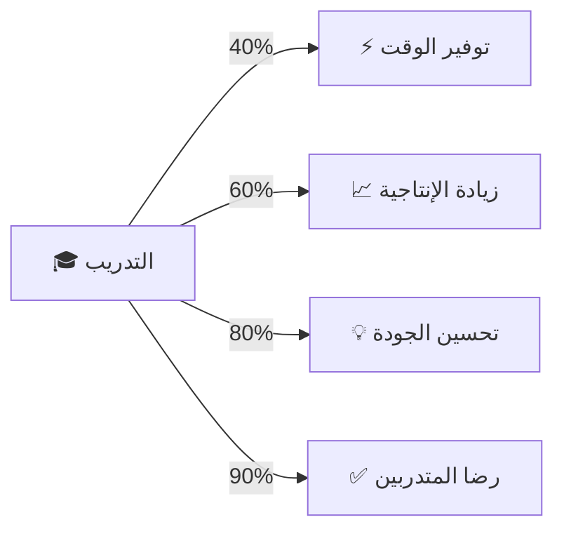

<div align="center">

# 🚀 حقيبة تدريب الذكاء الاصطناعي


**حقيبة تدريبية حديثة وشاملة في الذكاء الاصطناعي والأتمتة والإنتاجية**

[🔗 **الدخول للحقيبة التدريبية**](training-package/) • [📚 المحتويات](#محتويات-الحقيبة) • [✨ المميزات](#المميزات-الرئيسية)

</div>

---

## 📌 عن هذا المشروع

هذا المستودع هو **إعلان ومؤشر** للحقيبة التدريبية الكاملة في الذكاء الاصطناعي. المحتوى الفعلي يتم استضافته على **GitHub Pages** مع حماية عالية المستوى.

### 🎯 الهدف الرئيسي


</div>

**GenAI Training Kit** هي حقيبة تدريبية احترافية شاملة تم تصميمها خصيصاً لتمكين المؤسسات (خاصة قطاع البترول والطاقة) من استخدام أدوات الذكاء الاصطناعي التوليدي لزيادة الإنتاجية والابتكار وتحقيق التحول الرقمي.

<div align="center">

### 📊 المعلومات الأساسية

<table>
<tr>
<td align="center" width="50%">

**⏱️ المدة الإجمالية**
<br>


</td>
<td align="center" width="50%">

**📅 توزيع الوقت**
<br>


</td>
</tr>
<tr>
<td align="center">

**📈 المستوى**
<br>


</td>
<td align="center">

**👥 الجمهور**
<br>


</td>
</tr>
<tr>
<td align="center">

**🌐 اللغة**
<br>


</td>
<td align="center">

**📜 الترخيص**
<br>


</td>
</tr>
</table>

</div>

---

<div align="center">

## 🎯 الأهداف التدريبية الرئيسية


### ✨ بعد إتمام هذا التدريب، ستكون قادراً على:

</div>

<table>
<tr>
<td width="50%" valign="top">

### 🧠 **فهم الأساسيات**

- 🔹 فهم كيفية عمل نماذج اللغة الكبيرة (LLMs)
- 🔹 التمييز بين ChatGPT و Claude و Gemini
- 🔹 حساب تكاليف الاستخدام والـ Tokens

### 🎨 **المحتوى الإبداعي**

- 🔹 إنتاج محتوى مرئي احترافي (صور، فيديو، عروض)
- 🔹 بناء حملات تسويقية متكاملة
- 🔹 تصميم عروض تقديمية في دقائق

### 📊 **تحليل البيانات والذكاء**

- 🔹 تحليل بيانات معقدة بدون معادلات برمجية
- 🔹 بناء نماذج تنبؤ بسيطة
- 🔹 إنشاء لوحات معلومات تفاعلية

</td>
<td width="50%" valign="top">

### ⚡ **هندسة الأوامر (Prompt Engineering)**

- 🔹 كتابة أوامر احترافية باستخدام صيغ R-T-F و C-A-R
- 🔹 إنشاء 50+ برومبت متخصص لعملك
- 🔹 تطوير مكتبة برومبتات مخصصة

### 🤖 **الإنتاجية والأتمتة**

- 🔹 أتمتة العمليات المكررة بدون كود برمجي
- 🔹 إنشاء تقارير دورية تلقائية
- 🔹 توفير **40%+** من وقت العمل اليومي

### 🎓 **التطبيق العملي**

- 🔹 حل مشاكل حقيقية من إدارتك
- 🔹 تطوير مشروع تخرج مبتكر
- 🔹 بناء حلول AI مخصصة لشركتك

</td>
</tr>
</table>

<div align="center">


</div>

---

<div align="center">

## 📚 محتويات الحقيبة التفصيلية


</div>

### 🎯 دليل شامل لجميع ملفات الحقيبة (15 ملف)

<details open>
<summary><b>📋 التخطيط والأجندة (1 ملف)</b></summary>
<br>

| الملف | الوصف                                                    | المحتوى                                                     | الحجم |
| :---: | :------------------------------------------------------- | :---------------------------------------------------------- | :---: |
|  📋   | **[02-الاجندة-التدريبية.md](./02-الاجندة-التدريبية.md)** | جدول تفصيلي للـ 4 أيام مع جميع الجلسات والأوقات والاستراحات | متوسط |

</details>

<details open>
<summary><b>🛠️ المحتوى العلمي والأدوات (3 ملفات)</b></summary>
<br>

| الملف | الوصف                                                                    | المحتوى                                           | الحجم |
| :---: | :----------------------------------------------------------------------- | :------------------------------------------------ | :---: |
|  🛠️   | **[01-ادوات-الذكاء-الاصطناعي.md](./01-ادوات-الذكاء-الاصطناعي.md)**       | قائمة 50+ أداة مجانية/Freemium مصنفة حسب الفئة    | كبير  |
|  🏭   | **[03-امثلة-عملية-قطاع-البترول.md](./03-امثلة-عملية-قطاع-البترول.md)**   | حالات دراسية حقيقية من قطاع البترول والطاقة       | متوسط |
|  💼   | **[10-ادوات-ذكاء-اصطناعي-متقدمة.md](./10-ادوات-ذكاء-اصطناعي-متقدمة.md)** | 50 أداة متخصصة ومتقدمة + وكلاء أذكياء (AI Agents) | كبير  |

</details>

<details open>
<summary><b>📝 التمارين العملية (3 ملفات)</b></summary>
<br>

| الملف | الوصف                                                        | المحتوى                                          | الحجم |
| :---: | :----------------------------------------------------------- | :----------------------------------------------- | :---: |
|  📝   | **[06-تمارين-اليوم-الاول.md](./06-تمارين-اليوم-الاول.md)**   | تمارين الأساسيات وهندسة الأوامر (R-T-F, C-A-R)   | متوسط |
|  🎨   | **[07-تمارين-اليوم-الثاني.md](./07-تمارين-اليوم-الثاني.md)** | تمارين المحتوى الإبداعي والتسويق والصور والفيديو | متوسط |
|  📊   | **[08-تمارين-اليوم-الثالث.md](./08-تمارين-اليوم-الثالث.md)** | تمارين التحليل والأتمتة وسير العمل               | متوسط |

</details>

<details open>
<summary><b>🎓 المشاريع والمكتبات (4 ملفات)</b></summary>
<br>

| الملف | الوصف                                                                | المحتوى                                  |   الحجم   |
| :---: | :------------------------------------------------------------------- | :--------------------------------------- | :-------: |
|  🎓   | **[05-مشروع-التخرج.md](./05-مشروع-التخرج.md)**                       | مشروع تطبيقي متكامل + معايير التقييم     |   صغير    |
|  📚   | **[04-مكتبة-البرومبتات.md](./04-مكتبة-البرومبتات.md)**               | 100 برومبت احترافي جاهز للاستخدام الفوري | كبير جداً |
|  ✨   | **[13-برومبتات-متقدمة-ابداعية.md](./13-برومبتات-متقدمة-ابداعية.md)** | 50 برومبت إبداعي متقدم لسيناريوهات معقدة |   كبير    |
|  💡   | **[14-افكار-خارج-الصندوق.md](./14-افكار-خارج-الصندوق.md)**           | 27 فكرة إبداعية وغير تقليدية للتطبيق     |   متوسط   |

</details>

<details open>
<summary><b>🎤 الموارد الإضافية والمراجع (4 ملفات)</b></summary>
<br>

| الملف | الوصف                                                            | المحتوى                                |   الحجم   |
| :---: | :--------------------------------------------------------------- | :------------------------------------- | :-------: |
|  🎤   | **[11-العرض-التقديمي-الكامل.md](./11-العرض-التقديمي-الكامل.md)** | عرض تقديمي 19 شريحة للمدربين           |   متوسط   |
|  🎨   | **[12-الانفوجرافيك-البصري.md](./12-الانفوجرافيك-البصري.md)**     | 9 تصاميم انفوجرافيك للطباعة والعرض     |   صغير    |
|  🔗   | **[09-مراجع-اضافية.md](./09-مراجع-اضافية.md)**                   | مصادر للتعلم المستمر + قنوات يوتيوب    |   متوسط   |
|  🌐   | **[15-قائمة-الروابط-الشاملة.md](./15-قائمة-الروابط-الشاملة.md)** | 🆕 قائمة شاملة بـ 150+ رابط مصنف ومنظم | كبير جداً |

</details>

<div align="center">

### 📊 إحصائيات المحتوى

<table>
<tr>
<td align="center"></td>
<td align="center"></td>
<td align="center"></td>
<td align="center"></td>
</tr>
<tr>
<td align="center"></td>
<td align="center"></td>
<td align="center"></td>
<td align="center"></td>
</tr>
</table>

</div>

---

<div align="center">

## 📅 جدول التدريب الزمني


</div>

<table>
<tr>
<td width="50%" valign="top">

### 🌅 اليوم الأول: الأساسيات


```
⏰ 45د  | ترحيب ومسار الورشة
⏰ 75د  | ما هو GenAI ولماذا الآن؟
⏰ 75د  | منظومة الأدوات الرئيسية
⏰ 45د  | صيغة R-T-F
⏰ 45د  | صيغة C-A-R
💡 30د  | Pro Tip: الحقل المتغير
```

### 🌥️ اليوم الثالث: التحليل والأتمتة


```
⏰ 75د  | تحليل البيانات الذكي
⏰ 45د  | التنبؤ البسيط
⏰ 75د  | أتمتة سير العمل
⏰ 60د  | التقارير الدورية
⏰ 45د  | لوحة القرارات
💡 15د  | Pro Tip: الروبوت الظاهري
```

</td>
<td width="50%" valign="top">

### 🌤️ اليوم الثاني: المحتوى الإبداعي


```
⏰ 90د  | منصة المحتوى الإبداعي
⏰ 90د  | إنتاج الصور بالـ AI
⏰ 60د  | العروض التقديمية الآنية
⏰ 60د  | الحملات التسويقية
💡 15د  | Pro Tip: الامتدادات المجانية
```

### 🌆 اليوم الرابع: الدمج والأخلاقيات


```
⏰ 60د  | سير عمل متكامل
⏰ 45د  | نماذج مفتوحة
⏰ 60د  | الأخلاقيات والخصوصية
⏰ 60د  | إدارة التغيير
⏰ 45د  | مستقبل الوظائف
💡 30د  | Pro Tip: AI الشخصي
🎓 15د  | الختام والشهادات
```

</td>
</tr>
</table>

<div align="center">

</div>

---

<div align="center">

## 🎓 الفئات المستهدفة


### 💼 هذه الحقيبة موجهة لجميع الإدارات والأقسام

</div>

<table>
<tr>
<td align="center" width="25%">

### 👔 الموارد البشرية


✅ كتابة عقود  
✅ تقييمات الأداء  
✅ أسئلة المقابلات  
✅ وصف وظيفي

</td>
<td align="center" width="25%">

### 💰 المالية


✅ تحليل بيانات مالية  
✅ توقعات الميزانية  
✅ تقارير دورية  
✅ كشف الاحتيال

</td>
<td align="center" width="25%">

### 📢 التسويق


✅ محتوى إبداعي  
✅ صور احترافية  
✅ حملات متكاملة  
✅ فيديو ترويجي

</td>
<td align="center" width="25%">

### 🛡️ السلامة (HSE)


✅ تقارير السلامة  
✅ تحليل حوادث  
✅ حملات توعية  
✅ إجراءات طوارئ

</td>
</tr>
<tr>
<td align="center">

### 🚀 العمليات


✅ أتمتة العمليات  
✅ جدولة المهام  
✅ متابعة الأداء  
✅ تحسين الإنتاجية

</td>
<td align="center">

### 📞 خدمة العملاء


✅ ردود ذكية  
✅ بناء Chatbots  
✅ تحليل الشكاوى  
✅ تحسين الخدمة

</td>
<td align="center">

### 📊 الإدارة العليا


✅ لوحات قرارات  
✅ تقارير تنفيذية  
✅ رؤى استراتيجية  
✅ تحليل المنافسين

</td>
<td align="center">

### ⛽ محطات الوقود


✅ إدارة العمليات  
✅ التسويق المحلي  
✅ خدمة العملاء  
✅ تقارير المبيعات

</td>
</tr>
</table>

---

## 🌟 نقاط القوة الفريدة

### 💪 المميزات الرئيسية

| الميزة            | الوصف                                   |
| ----------------- | --------------------------------------- |
| **عملية 100%**    | كل مثال مرتبط بعمليات حقيقية في البترول |
| **شاملة جداً**    | 14 ملف + 100+ أداة + 100+ برومبت        |
| **مجانية تماماً** | جميع الأدوات مجانية أو Freemium         |
| **سهلة التطبيق**  | بدون الحاجة لمعرفة برمجية               |
| **مسطرة جداً**    | خطوات واضحة وسهلة المتابعة              |
| **إبداعية**       | 27 فكرة "خارج الصندوق"                  |
| **مرئية**         | عروض وانفوجرافيكس جاهزة                 |
| **قابلة للتطوير** | يمكن إضافة محتوى جديد بسهولة            |

---

<div align="center">

## 🚀 كيفية البدء


</div>

<table>
<tr>
<td width="33%" valign="top">

### 👨‍🏫 للمدربين


```diff
+ 1. اقرأ الأجندة التدريبية بالكامل
+ 2. جهز الأدوات المطلوبة
+ 3. تحقق من الروابط
+ 4. مارس كل تمرين قبل التدريب
+ 5. جهز بيانات تدريبية واقعية
+ 6. اختبر الإنترنت والأجهزة
+ 7. راجع العرض التقديمي
+ 8. احضر أمثلة من شركتك
```

<div align="center">

</div>

</td>
<td width="33%" valign="top">

### 👥 للمتدربين


```diff
+ 1. جهز جهاز كمبيوتر/لابتوب
+ 2. تأكد من الإنترنت القوي
+ 3. أنشئ حساب Gmail
+ 4. اقرأ المقدمة والأهداف
+ 5. احضر جاهزاً للتمارين
+ 6. جهز مشكلة من عملك
+ 7. احضر دفتر وقلم للملاحظات
+ 8. كن مستعداً للتفاعل
```

<div align="center">

</div>

</td>
<td width="33%" valign="top">

### 🏢 للمؤسسات


```diff
+ 1. اختر المدرب المناسب
+ 2. جهز الموقع التدريبي
+ 3. وفر الأجهزة والإنترنت
+ 4. اختر فترة التدريب
+ 5. وفر دعماً إدارياً
+ 6. حدد المشاركين
+ 7. تابع التطبيق بعد التدريب
+ 8. قيّم ROI والنتائج
```

<div align="center">

</div>

</td>
</tr>
</table>

<div align="center">

### 📋 المتطلبات الأساسية

<table>
<tr>
<td align="center">

**💻 الأجهزة**


كمبيوتر/لابتوب حديث

</td>
<td align="center">

**🌐 الإنترنت**


اتصال ثابت وسريع

</td>
<td align="center">

**🔗 المتصفح**


متصفح حديث

</td>
<td align="center">

**🔐 الحساب**


حساب Gmail فعّال

</td>
</tr>
</table>

</div>

---

## 📋 المتطلبات الأساسية

### الأجهزة والبرامج

- 💻 جهاز كمبيوتر/لابتوب
- 🌐 اتصال إنترنت (2+ Mbps)
- 🔗 متصفح حديث (Chrome أو Edge)
- 🔐 حساب Gmail فعّال

### التطبيقات المطلوبة (كلها مجانية)

- ChatGPT أو Microsoft Copilot
- Google Drive / Google Sheets
- Canva (نسخة مجانية)
- Midjourney أو DALL-E (تجريبي)
- Zapier أو Make (خطط مجانية)

---

<div align="center">

## 📊 الإحصائيات والأرقام


### 🎯 محتويات الحقيبة بالأرقام

<table>
<tr>
<td align="center" width="16.66%">

<br><b>ملف شامل</b>
<br><sub>🆕 +1 ملف جديد</sub>
</td>
<td align="center" width="16.66%">

<br><b>برومبت احترافي</b>
<br><sub>جاهز للاستخدام</sub>
</td>
<td align="center" width="16.66%">

<br><b>أداة AI مجانية</b>
<br><sub>Freemium</sub>
</td>
<td align="center" width="16.66%">

<br><b>رابط مصنف</b>
<br><sub>منظم ومحدث</sub>
</td>
<td align="center" width="16.66%">

<br><b>ساعة تدريبية</b>
<br><sub>4 أيام مكثفة</sub>
</td>
<td align="center" width="16.66%">

<br><b>أهداف رئيسية</b>
<br><sub>واضحة وقابلة للقياس</sub>
</td>
</tr>
</table>

<table>
<tr>
<td align="center" width="16.66%">

<br><b>حالة دراسية</b>
<br><sub>من القطاع</sub>
</td>
<td align="center" width="16.66%">

<br><b>فكرة إبداعية</b>
<br><sub>خارج الصندوق</sub>
</td>
<td align="center" width="16.66%">

<br><b>شريحة احترافية</b>
<br><sub>جاهزة للعرض</sub>
</td>
<td align="center" width="16.66%">

<br><b>انفوجرافيك</b>
<br><sub>للطباعة</sub>
</td>
<td align="center" width="16.66%">

<br><b>كورسات مجانية</b>
<br><sub>موثقة ومعتمدة</sub>
</td>
<td align="center" width="16.66%">

<br><b>قناة يوتيوب</b>
<br><sub>للمتابعة</sub>
</td>
</tr>
</table>

<br>

### 📈 معدلات النجاح المتوقعة



</div>

---

<div align="center">

## 🔗 الروابط والأدوات المهمة


### 🤖 الأدوات الأساسية للذكاء الاصطناعي

<table>
<tr>
<td align="center" width="20%">
<a href="https://chat.openai.com" target="_blank">

</a>
<br><sub>نموذج لغة رائد</sub>
</td>
<td align="center" width="20%">
<a href="https://claude.ai" target="_blank">

</a>
<br><sub>بديل متقدم</sub>
</td>
<td align="center" width="20%">
<a href="https://gemini.google.com" target="_blank">

</a>
<br><sub>قوة Google</sub>
</td>
<td align="center" width="20%">
<a href="https://perplexity.ai" target="_blank">

</a>
<br><sub>البحث الذكي</sub>
</td>
<td align="center" width="20%">
<a href="https://poe.com" target="_blank">

</a>
<br><sub>بوابة موحدة</sub>
</td>
</tr>
</table>

### 🎨 أدوات الإنتاجية والإبداع

<table>
<tr>
<td align="center" width="20%">
<a href="https://canva.com" target="_blank">

</a>
<br><sub>التصميم السهل</sub>
</td>
<td align="center" width="20%">
<a href="https://gamma.app" target="_blank">

</a>
<br><sub>العروض الذكية</sub>
</td>
<td align="center" width="20%">
<a href="https://zapier.com" target="_blank">

</a>
<br><sub>الأتمتة بسهولة</sub>
</td>
<td align="center" width="20%">
<a href="https://make.com" target="_blank">

</a>
<br><sub>تدفقات معقدة</sub>
</td>
<td align="center" width="20%">
<a href="https://notion.so" target="_blank">

</a>
<br><sub>إدارة شاملة</sub>
</td>
</tr>
</table>

<details>
<summary><b>🔍 اضغط لرؤية المزيد من الأدوات</b></summary>
<br>

**📝 أدوات الكتابة:**

- [Jasper AI](https://jasper.ai) | [Copy.ai](https://copy.ai) | [Writesonic](https://writesonic.com)

**🎨 أدوات التصميم:**

- [Midjourney](https://midjourney.com) | [DALL-E](https://openai.com/dall-e-3) | [Leonardo.ai](https://leonardo.ai)

**📊 أدوات التحليل:**

- [Julius AI](https://julius.ai) | [Obviously.ai](https://obviously.ai) | [Rows.com](https://rows.com)

**🎬 أدوات الفيديو:**

- [Runway ML](https://runway.ml) | [HeyGen](https://heygen.com) | [Descript](https://descript.com)

**🔗 المزيد:** راجع ملف [15-قائمة-الروابط-الشاملة.md](./15-قائمة-الروابط-الشاملة.md) للقائمة الكاملة!

</details>

</div>

---

<div align="center">

## 👨‍🎓 معلومات المدرب


<br>


<br>

<table>
<tr>
<td align="center" width="50%">

### 🎯 التخصص

```
🔹 مهندس ميكاترونكس
🔹 مدير منتجات رقمية وذكاء اصطناعي
🔹 مؤسس RoboVAI Solutions
🔹 مؤسس مبادرة TechnoEgypt
```

</td>
<td align="center" width="50%">

### 💼 الخبرات

```
✅ تطبيقات الذكاء الاصطناعي
✅ التحول الرقمي للمؤسسات
✅ إدارة المشاريع الرقمية
✅ تدريب وتأهيل الكوادر
```

</td>
</tr>
</table>

<br>

### 🔗 تواصل معي

<p align="center">
<a href="https://linkedin.com/in/moshabann" target="_blank">

</a>
<a href="https://github.com/m0shaban" target="_blank">

</a>
<a href="https://robovai.blogspot.com" target="_blank">

</a>
<a href="mailto:contact.robovai@gmail.com">

</a>
<a href="https://wa.me/201121891913" target="_blank">

</a>
</p>


</div>

---

<div align="center">

## 📜 الترخيص وحقوق الملكية الفكرية


<br>


<br>

**جميع الحقوق محفوظة © 2025 | م. محمد شعبان - RoboVAI Solutions**

</div>

```
═══════════════════════════════════════════════════════════════════════
                     🔒 حقوق الملكية والترخيص الخاص
═══════════════════════════════════════════════════════════════════════

Copyright © 2025 م. محمد شعبان (Mohamed Shaban) - RoboVAI Solutions
جميع الحقوق محفوظة | All Rights Reserved

───────────────────────────────────────────────────────────────────────
📋 شروط الاستخدام | Terms of Use
───────────────────────────────────────────────────────────────────────

✅ الاستخدامات المسموحة (Permitted Uses):

   1. 📖 المشاهدة والقراءة للأغراض التعليمية الشخصية
   2. 🎓 الاستخدام في جلسات التدريب الرسمية بعد الحصول على إذن
   3. 👨‍🎓 الوصول للطلاب والمتدربين المسجلين في البرنامج
   4. 📚 المراجعة والدراسة الذاتية غير التجارية
   5. ⭐ مشاركة الرابط (وليس المحتوى) مع الآخرين

❌ الاستخدامات الممنوعة (Prohibited Uses):

   1. 🚫 الاستخدام التجاري أو الربحي دون إذن كتابي صريح
   2. 🚫 إعادة التوزيع أو البيع أو الترخيص من الباطن
   3. 🚫 تقديم دورات تدريبية مدفوعة باستخدام هذه المواد
   4. 🚫 النسخ أو التعديل أو إنشاء أعمال مشتقة للاستخدام التجاري
   5. 🚫 إزالة أو تعديل إشعارات حقوق النشر
   6. 🚫 الادعاء بملكية المحتوى أو التأليف
   7. 🚫 رفع المحتوى على منصات أخرى بدون إذن

───────────────────────────────────────────────────────────────────────
💼 للاستخدام التجاري والمؤسسي | For Commercial/Corporate Use
───────────────────────────────────────────────────────────────────────

هل تمثل مؤسسة أو شركة وترغب في استخدام هذه الحقيبة التدريبية؟

📧 تواصل معنا للحصول على ترخيص تجاري:

   ✉️  Email: contact.robovai@gmail.com
   📱 WhatsApp: +201121891913
   🔗 LinkedIn: linkedin.com/in/moshabann

   نقدم:
   • تراخيص مؤسسية مخصصة
   • تدريب مباشر لفرق العمل
   • تخصيص المحتوى حسب القطاع
   • دعم فني ومتابعة

───────────────────────────────────────────────────────────────────────
⚖️ إخلاء المسؤولية | Disclaimer
───────────────────────────────────────────────────────────────────────

تُقدم هذه المواد التدريبية "كما هي" دون أي ضمانات صريحة أو ضمنية.
المؤلف غير مسؤول عن أي أضرار مباشرة أو غير مباشرة قد تنتج عن
استخدام هذه المواد.

───────────────────────────────────────────────────────────────────────
📞 الإبلاغ عن انتهاك حقوق الملكية | Report Copyright Violation
───────────────────────────────────────────────────────────────────────

إذا لاحظت استخداماً غير مصرح به لهذه المواد، يرجى التواصل فوراً:
📧 contact.robovai@gmail.com

═══════════════════════════════════════════════════════════════════════
```

<div align="center">

### 🤝 الغرض من هذا المستودع

<table>
<tr>
<td align="center" width="33%">

<br><b>عرض الحقيبة للمؤسسات</b>
<br><sub>لجذب العملاء المحتملين</sub>
</td>
<td align="center" width="33%">

<br><b>سهولة الوصول للمتدربين</b>
<br><sub>في الدورات المعتمدة</sub>
</td>
<td align="center" width="33%">

<br><b>الاستخدام التجاري</b>
<br><sub>بإذن وترخيص فقط</sub>
</td>
</tr>
</table>

<br>

### ⭐ أعجبك المحتوى؟

**لا تنسَ إعطاء نجمة ⭐ للمشروع لدعم العمل المجاني!**

**💼 للحصول على ترخيص تجاري أو حجز دورة تدريبية، تواصل معنا مباشرة**

</div>

---

<div align="center">

## 🤝 المساهمة والدعم


### 💪 هل تريد تحسين هذه الحقيبة؟

</div>

<table>
<tr>
<td align="center" width="50%">

### 🔀 خطوات المساهمة

```bash
# 1. Fork المشروع
git clone https://github.com/your-username/GenAI-Traning-Kit

# 2. أنشئ فرع جديد
git checkout -b feature/amazing-feature

# 3. أضف تغييراتك
git add .

# 4. اعمل Commit
git commit -m 'إضافة ميزة رائعة'

# 5. اعمل Push
git push origin feature/amazing-feature

# 6. افتح Pull Request
```

</td>
<td align="center" width="50%">

### 🎯 طرق المساهمة

✅ **إضافة محتوى جديد**

- برومبتات إضافية
- أمثلة عملية
- حالات دراسية

✅ **تحسين المحتوى**

- تصحيح أخطاء
- تحسين التنسيق
- إضافة صور وتوضيحات

✅ **ترجمة**

- ترجمة للإنجليزية
- ترجمة لغات أخرى

✅ **مشاركة التجربة**

- آراء وملاحظات
- اقتراحات للتطوير

</td>
</tr>
</table>

<div align="center">

### 🌟 طرق دعم المشروع

<table>
<tr>
<td align="center">

<br><sub>أعطِ نجمة للمشروع</sub>
</td>
<td align="center">

<br><sub>شارك مع الآخرين</sub>
</td>
<td align="center">

<br><sub>أرسل ملاحظاتك</sub>
</td>
<td align="center">

<br><sub>أبلغ عن الأخطاء</sub>
</td>
</tr>
</table>

</div>

---

<div align="center">

## 📞 التواصل والدعم


### 💌 طرق التواصل المتاحة

<table>
<tr>
<td align="center" width="20%">
<a href="mailto:contact.robovai@gmail.com">

<br><b>البريد الإلكتروني</b>
<br><sub>contact.robovai@gmail.com</sub>
</a>
</td>
<td align="center" width="20%">
<a href="https://wa.me/201121891913" target="_blank">

<br><b>واتساب</b>
<br><sub>+201121891913</sub>
</a>
</td>
<td align="center" width="20%">
<a href="https://linkedin.com/in/moshabann" target="_blank">

<br><b>لينكد إن</b>
<br><sub>@moshabann</sub>
</a>
</td>
<td align="center" width="20%">
<a href="https://robovai.blogspot.com" target="_blank">

<br><b>المدونة</b>
<br><sub>RoboVAI.com</sub>
</a>
</td>
<td align="center" width="20%">
<a href="https://facebook.com/technoegypt0" target="_blank">

<br><b>فيسبوك</b>
<br><sub>TechnoEgypt</sub>
</a>
</td>
</tr>
</table>

<br>

### 💝 أحببت المشروع؟ ساعدنا في نشره!

<table>
<tr>
<td align="center" width="25%">

<br><b>أعطِ نجمة</b>
<br><sub>للمشروع على GitHub</sub>
</td>
<td align="center" width="25%">

<br><b>شارك المشروع</b>
<br><sub>مع زملائك وأصدقائك</sub>
</td>
<td align="center" width="25%">

<br><b>اترك تعليق</b>
<br><sub>شاركنا رأيك واقتراحاتك</sub>
</td>
<td align="center" width="25%">

<br><b>أبلغ عن مشاكل</b>
<br><sub>ساعدنا في التحسين</sub>
</td>
</tr>
</table>

</div>

---

<div align="center">

## 📈 خارطة الطريق المستقبلية


</div>

<table>
<tr>
<td width="50%" valign="top">

### 🎯 المخطط للربع الأول 2026

- [ ] 🌐 إضافة نسخة إنجليزية شاملة
- [ ] 🎥 فيديوهات توضيحية لكل درس
- [ ] 📱 تطبيق ويب تفاعلي للتدريب
- [ ] 🎓 شهادات رقمية للمتدربين
- [ ] 📝 اختبارات تفاعلية أونلاين
- [ ] 🎧 مقاطع صوتية (Podcasts)

</td>
<td width="50%" valign="top">

### 🚀 المخطط طويل المدى

- [ ] 🏭 نسخ متخصصة لقطاعات مختلفة
- [ ] 🤝 شراكات مع مؤسسات تدريبية
- [ ] 📚 إصدار كتاب إلكتروني
- [ ] 🎪 ورش عمل حية (Webinars)
- [ ] 🌍 توسيع نطاق الوصول عربياً
- [ ] 🏆 برنامج شهادات معتمدة

</td>
</tr>
</table>

---

<div align="center">


<br><br>

### 🎓 رحلة التحول الرقمي تبدأ من هنا!

<br>


<br>

**Copyright © 2025 [محمد شعبان](https://github.com/m0shaban) | RoboVAI Solutions**

<br>

### 🔒 تنبيه حقوق الملكية الفكرية

<table>
<tr>
<td align="center">

**⚠️ محتوى محمي**

هذه الحقيبة التدريبية محمية بحقوق الملكية الفكرية  
الاستخدام التجاري ممنوع بدون إذن كتابي

📄 [اقرأ شروط الترخيص الكاملة](./LICENSE) | [إشعار حقوق النشر](./COPYRIGHT.md)

</td>
</tr>
</table>

<br>

<a href="#"></a>

<br><br>


</div>
